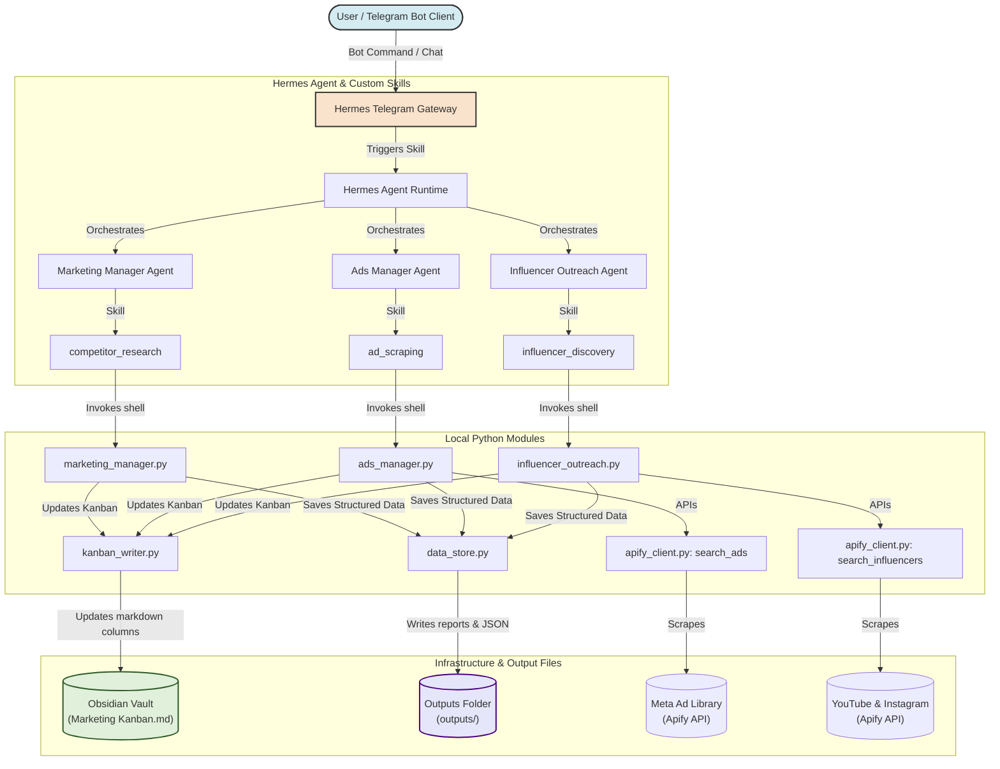

# CrowdWisdomTrading Marketing Agent — Multi-Agent System

An autonomous, multi-agent marketing and research pipeline designed to scale organic outreach, analyze competitors, scrape advertising materials, extract emotional triggers, and write high-converting video scripts for **CrowdWisdomTrading (CWT)**.

This system is powered by the **Nous Research Hermes Agent** framework, orchestrating dedicated subagents, custom Python toolsets, and external API connectors. It integrates with the **Telegram Bot Gateway** for remote control and automatically updates an **Obsidian Kanban Board** in real-time to visualize operational in progress.

---

## 1. Product Overview: CrowdWisdomTrading (CWT)

**CrowdWisdomTrading** is a specialized analytics and signal platform designed to help retail investors trade with clarity and peace of mind.

*   **The Problem:** Retail traders fail because of **cognitive overload**. They jump from one chatroom, Discord server, and YouTube channel to another, getting drowned in conflicting noise and panic.
*   **The Antidote:** Collective Intelligence. CWT filters the noise by aggregating the real-time sentiment and conviction of over **5,000+ professional traders** into a single screen.
*   **Core Value Propositions:**
    *   **Noise Filtering:** Consolidated, zero-hype consensus.
    *   **Actionable Setups:** High-conviction swing trade entry points, stop-losses, and profit targets.
    *   **Rhythm:** *"Sunday Read. Monday Act."* Designed to let busy professionals plan their week in 15 minutes and execute without mid-week stress.
*   **Tone of Voice:** Professional, evidence-based, realistic, direct, and risk-aware (no quick-rich promises). 

---

## 2. System Architecture

The marketing agent system uses a decoupled event-driven architecture, where commands sent via Telegram or CLI trigger specialized subagents that query external APIs and update local markdown databases:



---

## 3. Directory Layout & Pipeline Outputs

```
Ma4rketing Agent/
├── hermes_marketing/
│   ├── skills/
│   │   ├── competitor_research/      # Marketing Manager competitor audit
│   │   ├── ad_scraping/              # Ads Manager Meta library scraper
│   │   └── influencer_discovery/     # Discovers retail trading influencers
│   ├── tools/
│   │   ├── apify_client.py           # Apify API client wrapper (handles DCO unrendering)
│   │   ├── kanban_writer.py          # Programmatically shifts Obsidian Kanban cards
│   │   └── data_store.py             # File I/O helpers saving data to outputs/
│   ├── outputs/
│   │   ├── competitor_report.md      # Positioning guide and competitor matrix
│   │   ├── best_ads_last_30_days.json # Scraped Meta Ads (DCO-extracted real copy)
│   │   ├── ad_pain_points.json       # Extracted hooks & psychological triggers
│   │   ├── generated_scripts/        # High-converting video scripts
│   │   ├── influencers.json          # Scraped creators (200K+ verified followers)
│   │   ├── outreach_drafts/          # Dynamic, custom-personalized email drafts
│   │   └── social_posts_drafts.md    # Repurposed organic X and LinkedIn threads
│   └── config/
│       └── hermes.config.yaml        # Provider, model, and gateway configurations
├── obsidian_vault/
│   └── Marketing Kanban.md           # Markdown file parsed as a community Kanban board
├── .env                              # Environment variable keys (gitignored)
├── requirements.txt                  # Python project dependencies
└── README.md                         # Documentation (this file)
```

---

## 4. Setup & Installation

### Step 1: Install Python Environment
Ensure you have Python 3.10+ installed. In your terminal, run:
```powershell
python -m venv venv
.\venv\Scripts\Activate.ps1
pip install -r requirements.txt
```

### Step 2: Configure Environment Keys
Create a `.env` file in the root directory (copy from `.env.example`) and fill in:
```ini
OPENROUTER_API_KEY=your_openrouter_api_key
APIFY_API_TOKEN=your_apify_api_token
TELEGRAM_BOT_TOKEN=your_telegram_bot_token
GATEWAY_ALLOW_ALL_USERS=true
```

### Step 3: Install Nous Research Hermes Agent CLI
*   **Windows (PowerShell):**
    ```powershell
    irm https://raw.githubusercontent.com/NousResearch/hermes-agent/main/scripts/install.ps1 | iex
    ```
*   **Linux/WSL2/macOS:**
    ```bash
    curl -fsSL https://hermes-agent.nousresearch.com/install.sh | bash
    ```

Then run `hermes setup`, select **OpenRouter** as the LLM provider, and paste your API key when prompted.

---

## 5. How to Run and Start the System

### Option A: Run local test suite (Verification)
You can run the pytest test suite to verify that the local toolsets, Apify API connectors, and Kanban board updating functions work flawlessly:
```powershell
python -m pytest tests/
```

### Option B: Start the Telegram Bot Gateway (Remote Control)
To launch the Telegram gateway and connect the Hermes Agent to your bot in the foreground:
```powershell
python -m hermes_cli.main gateway run
```
*Once started, you can chat with the bot on Telegram to trigger the agents.*

---

## 6. How to Use the Bot

Open Telegram, search for your bot's handle (e.g. `@Ma4ketingbot`), and send **`/new`** to initialize a clean session. You can speak to the bot in natural language or send explicit run commands (do not add a leading slash `/` to these commands):

1.  **Competitor Research & Brand Strategy**
    *   *Command:* `run competitor_research`
    *   *Result:* Runs competitor research (TradingView, Benzinga, Trade Ideas, Stock Dads) and repurposes social copy. 
    *   *Files Updated:* [`competitor_report.md`](file:///c:/Users/kunal/OneDrive/pineapple/Ma4rketing%20Agent/hermes_marketing/outputs/competitor_report.md) and [`social_posts_drafts.md`](file:///c:/Users/kunal/OneDrive/pineapple/Ma4rketing%20Agent/hermes_marketing/outputs/social_posts_drafts.md).
    *   *Kanban:* Moves "Competitor Research" and "Social Post Repurposer" to `In Progress` ➔ `Done`.

2.  **Scrape Competitor Ads & Write Scripts**
    *   *Command:* `run ad_scraping`
    *   *Result:* Scrapes active ads, resolves unrendered dynamic creative variables, extracts psychological triggers, and writes Reels/YouTube video scripts.
    *   *Files Updated:* [`best_ads_last_30_days.json`](file:///c:/Users/kunal/OneDrive/pineapple/Ma4rketing%20Agent/hermes_marketing/outputs/best_ads_last_30_days.json), [`ad_pain_points.json`](file:///c:/Users/kunal/OneDrive/pineapple/Ma4rketing%20Agent/hermes_marketing/outputs/ad_pain_points.json), and script markdown files under [`generated_scripts/`](file:///c:/Users/kunal/OneDrive/pineapple/Ma4rketing%20Agent/hermes_marketing/outputs/generated_scripts/).
    *   *Kanban:* Moves "Ad Scraping", "Pain Point Extraction", and "Ad Script Writer" to `In Progress` ➔ `Done`.

3.  **Influencer Discovery & Outreach**
    *   *Command:* `run influencer_discovery`
    *   *Result:* Scrapes YouTube & Instagram for verified creators, checks follower thresholds, filters out placeholders, and writes personalized emails.
    *   *Files Updated:* [`influencers.json`](file:///c:/Users/kunal/OneDrive/pineapple/Ma4rketing%20Agent/hermes_marketing/outputs/influencers.json) and email markdown files under [`outreach_drafts/`](file:///c:/Users/kunal/OneDrive/pineapple/Ma4rketing%20Agent/hermes_marketing/outputs/outreach_drafts/).
    *   *Kanban:* Moves "Influencer Discovery" and "Cold Outreach Drafting" to `In Progress` ➔ `Done`.

---

## 7. Obsidian Kanban Integration
Open the `obsidian_vault` directory as a Vault in **Obsidian** and enable the **Kanban** community plugin. 

Open `Marketing Kanban.md` inside Obsidian to see a visual, drag-and-drop workflow dashboard. When the subagents run, the cards will automatically move between columns in real-time as they execute!

## 8. My Scope
Idea 1: The YouTube Sentiment Analyst & Topic Ideator (Highly Recommended)
Concept: A content strategy agent that takes the discovered influencers (like Humphrey Yang or Graham Stephan) and downloads the transcripts of their most recent trending videos. It extracts the exact questions, pain points, and current market trends the creators are discussing, and generates a Content Plan (highly optimized video hook titles and talking points) for CrowdWisdomTrading's own channel.
Why it's a great scope addition: We already have the transcript extraction code in 
youtube_transcript.py
. Extending it to automatically analyze trending topics and feed it to the Marketing Manager to generate CWT video ideas bridges the gap between influencer discovery and content creation.

Idea 2: Organic Viral Repurposer (X Threads & LinkedIn Stories)
Concept: A dedicated agent that takes the paid video script output (like noise_short.md) and automatically repurposes it into a formatted, high-hook X (Twitter) thread and a LinkedIn story tailored to CWT’s tone of voice.
Why it's a great scope addition: Paid ads only cover one side of marketing. This adds organic distribution. We already built a basic version of this in marketing_manager.py (which produces social_posts_drafts.md), but defining it as a full-fledged agent skill called social_distribution makes the multi-platform strategy complete.

Idea 3: The Affiliate & Tiered Partnership Customizer
Concept: Instead of a generic review request, this agent calculates a custom commercial proposal based on the creator's follower count and platform (e.g., offering a specific affiliate tier, custom promo code like CWT_HUMPHREY, and estimating their earning potential if 0.1% of their audience converts).
Why it's a great scope addition: Cold emails asking for "honest feedback" get low response rates. Adding a concrete, personalized partnership calculation makes the pitch highly professional and incentivizes them to reply.

Idea 4: Competitor Ad Strategy Analyst (Budget & Platform Estimator)
Concept: An agent that aggregates the scraped competitor ads and estimates which platforms are performing best (longevity of ads, spend estimates) to output a Platform Recommendation Report for CWT (e.g., "TradingView is running 80% of ads on Instagram with a focus on discount hooks; we recommend allocating 60% of CWT budget to Instagram Stories").
Why it's a great scope addition: It upgrades the Ads Manager from an "ad scraper" into a "strategic media planner," providing real business decision support.
